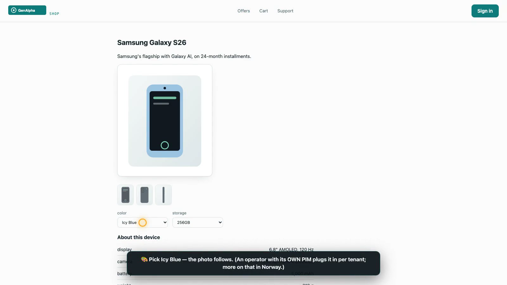
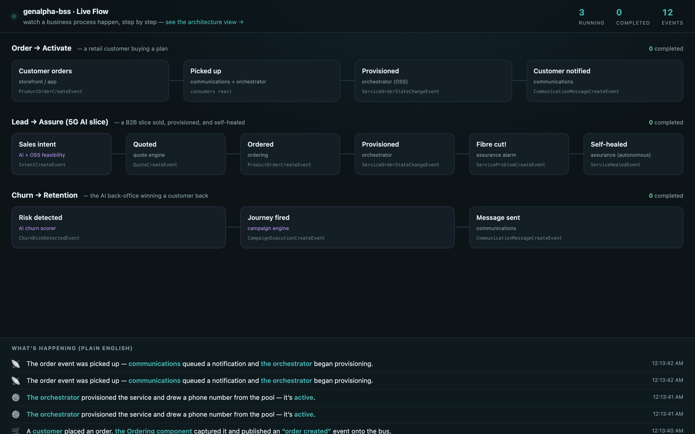
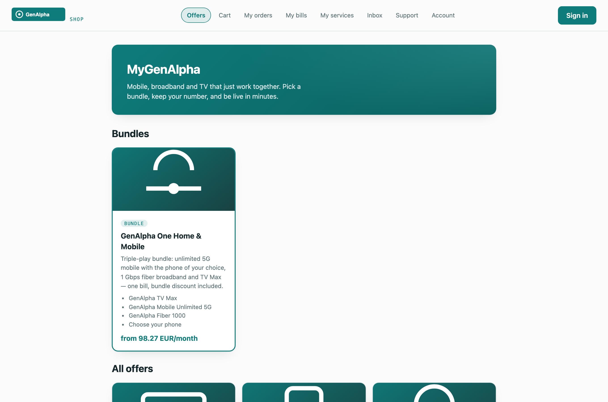
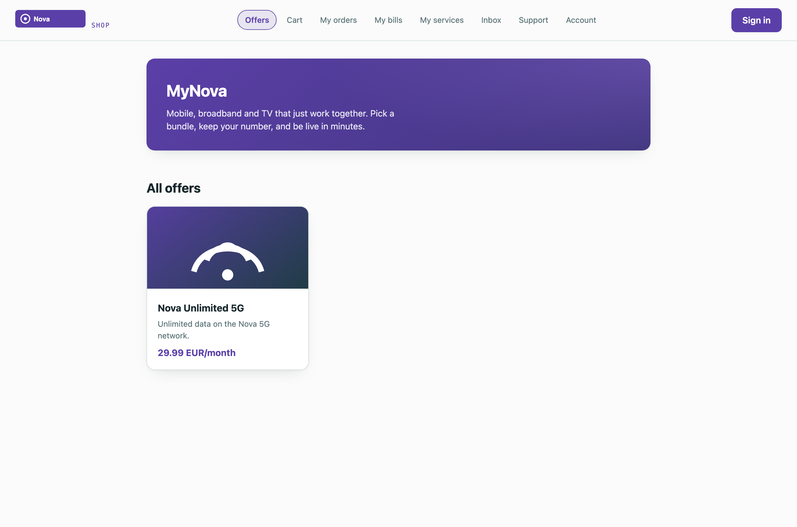
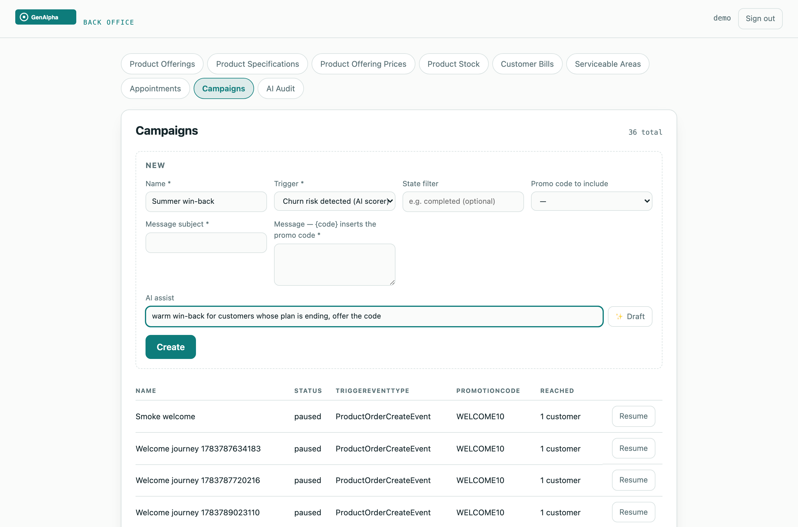
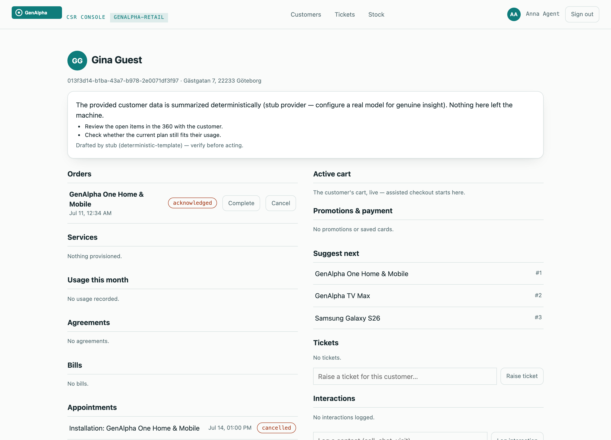
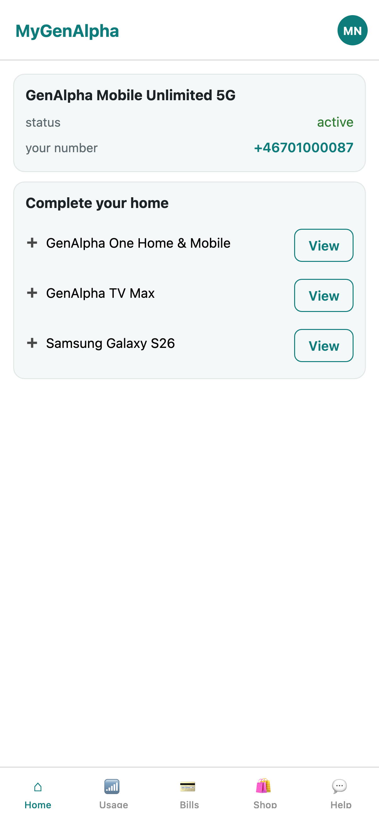

# genalpha-bss — a composable, multi-tenant BSS on TM Forum ODA

A vendor-neutral telecom **Business Support System** built as **31 composable ODA components**
(Spring Boot microservices exposing TMF Open APIs) plus **four channels** (three web, one mobile), behind one API
gateway. Any OIDC identity provider, any PostgreSQL, any Kafka-protocol broker — nothing
operator-specific is hardcoded. Two demo operators run side by side on a single deployment to
prove it.

**Every feature is verified end-to-end in a real browser** — ten Playwright suites drive the
storefront, guest checkout, both consoles, the mobile app, tenant isolation, role administration,
campaign journeys, the AI-slice lead-to-assure loop and BankID step-up against the full stack.
**Eleven official TM Forum CTKs pass with zero failures**: the five core (TMF620/622/632/637/666)
plus TMF663 shopping-cart, TMF669 party-role, TMF687 product-stock, TMF635 usage, TMF677
usage-consumption and TMF678 customer-bill. See the full, honest scorecard — including the two
intentional hardened gaps (payment, communication) — in
[docs/ctk-conformance.md](docs/ctk-conformance.md); reproduce any row with [ops/ctk](ops/ctk/README.md).

- 🎬 **Guided demo** — open `http://localhost:8080/flow/demo.html`, sign in as `demo`, press ▶: five narrated acts drive the LIVE system (order-to-activation, a rule born without a deploy, a reacting price, keep-your-number, leave-and-teach-the-AI) while Live Flow lights up beside them. Nothing on that page is mocked.
- 🛰️ **[Autonomy Accelerated — the 5G AI Slice PoC](docs/poc-ai-slice.html)** — the full lead-to-assure loop (AI intent → feasibility + edge upsell → token-priced quote → order → autonomous fibre-cut self-heal), drivable by an AI agent over MCP
- 📄 **[Product overview](docs/overview.html)** — the whole system as a readable webpage (browser Print → PDF for a shareable document)
- 📏 **[Product rules — how to use them](docs/product-rules.md)** — author order rules and dynamic pricing as data: console walkthrough, dry-run, customer experience, JSON-logic context reference, API examples
- 📐 **[Architecture views](docs/architecture.md)** — component map, tenancy model, order-to-bill flow, event backbone
- 🧩 **[ODA Composer](docs/composer.html)** — pick the modules a deployment needs; dependencies enforced; output is a Helm values override

## A look at it

**🎬 The journey film — a human using the real product, filmed across every screen.**
One take, no mocks: Mia configures the bundle (phone, color, add-on), joins mid-checkout, pays;
marketing ships a 15% pricing rule from the back office — as data; an agent fulfils her order in
the CSR console; her number and inbox light up in the shop; her next cart is already 15% cheaper;
and Live Flow narrates every event underneath.
**[▶ Watch the 1:43 journey (MP4)](docs/media/journey.mp4)** · re-record any time with
`node ops/e2e/journey_video.js`

<p align="center">
  <a href="docs/media/journey.mp4"></a>
</p>

**The guided demo, driving itself** — five narrated acts against the live system: a customer
orders and the machine activates them untouched; a business rule is born, enforced, and retired
without a deployment; a pricing rule turns €100 into €85; a customer keeps their number joining
us (NRDB port-in), then leaves with it — and the AI records the goodbye as a churn outcome it
learns from. Everything you see is a real API call; Live Flow lights up as the events land.
Run it yourself at `/flow/demo.html` ([full-speed MP4](docs/media/guided-demo.mp4)):

<p align="center">
  
</p>

**Live Flow** — watch a business process happen, step by step. An event-driven BSS's value is
loose coupling, which makes the magic invisible; this makes it legible to anyone. It reconstructs
live process instances from the `bss.*.events` stream and narrates each step in plain English —
a customer orders, the ordering component captures it and publishes an event, communications and
the orchestrator pick it up, the service activates, the customer is notified. Three processes run
live: retail **Order → Activate**, the B2B **Lead → Assure** slice (with a fibre cut that
self-heals), and **Churn → Retention** driven by the AI back-office. A companion
[architecture view](docs/img/live-flow.png) shows the same events as component choreography.

<p align="center">
  
</p>

One build of each channel serves every tenant; the host decides the brand. The same storefront,
GenAlpha in teal and Nova Telecom in purple — logo, name **and** color from the tenant manifest:

<p align="center">
  
  
</p>

Marketing runs campaigns from the back-office console — event triggers, promo codes, and an AI
copy assistant — while CSR agents get an AI copilot summarizing the customer 360; and the modular
mobile app recomposes around what the customer owns:

<p align="center">
  
  
</p>

<p align="center">
  
</p>

## The modules

**Core commerce (always deployed)**

| Component | TMF API | Port | What it does |
|---|---|---|---|
| product-catalog | TMF620 | 8081 | Offerings, prices, commitment terms, and **hard + soft bundles** (TMF620 `bundledProductOfferingOption` cardinality: mandatory components, optional standalone add-ons, and "pick N of M" choice groups enforced at order time) |
| product-ordering | TMF622 | 8082 | Order capture, validation, completion orchestration |
| product-inventory | TMF637 | 8083 | What each customer has, provisioned per order item |
| party-account | TMF632 / TMF666 / TMF669 | 8084 | Individuals, organizations, accounts, party roles |
| gateway | ODA exposure | 8080 | Single entry point; white-label host → tenant routing |

**Optional components** (leave any out via the [composer](docs/composer.html) — channels adapt)

| Component | TMF API | Port | What it does |
|---|---|---|---|
| product-stock | TMF687 | 8086 | Device shelf: reserve at order, consume at completion |
| payment | TMF676 | 8087 | Authorize/capture behind a PSP adapter (mock PSP in dev) |
| billing | TMF678 | 8088 | Billing runs: recurring + usage + discounts on one bill |
| qualification | TMF679 | 8089 | Serviceability: where fiber-class offerings can be delivered |
| appointment | TMF646 | 8091 | Installer slots, booked at checkout |
| trouble-ticket | TMF621 | 8092 | Support cases, org-scoped for partner agents |
| party-interaction | TMF683 | 8093 | Every touchpoint on the customer timeline |
| communication | TMF681 | 8095 | Event-driven notifications (the martech door) |
| shopping-cart | TMF663 | 8096 | Server-side carts: guest secret-id, claim on login, abandonment events |
| usage | TMF635 / TMF677 | 8097 | Mediation intake, rating, allowance meters, overage charges |
| agreement | TMF651 | 8098 | Commitment periods minted automatically at order completion |
| promotion | TMF671 | 8099 | Promo codes: anonymous validation → redemption → bill discount |
| user-roles | TMF672 | 8100 | Tenant admins manage staff via TMF API over their own IdP — surfaced as the console's **Staff tab** (search an operator, tick the areas they manage) |
| geographic-address | TMF673 | 8101 | Address validation + standardization at checkout |
| recommendation | TMF680 | 8102 | Cross-sell with a learning seam: rule-selected candidates, popularity-ranked (a trained model plugs into the same Ranker interface) |
| payment-method | TMF670 | 8103 | Tokenized card vault: save at checkout, pay bills one-click |
| document | TMF667 | 8106 | Content store: tenant logos and offering artwork the channels wear |
| campaign | martech | 8108 | Event-triggered journeys: once-per-customer messages carrying promo codes |
| quote | TMF648 | 8110 | B2B quotes born from intents: the OSS proposal priced, token allowances on line items, acceptance places the order |
| intelligence | AI | 8109 | Any-LLM seam (per-tenant overrides): copy assistant + CSR copilot + a churn engine that starts as transparent rules across BSS/CSR/assurance data and **learns in production** — feature snapshots accumulate from day one, outcomes label them, and a per-tenant logistic model trains in-service (or immediately from imported operator history) |
| flow | observability | 8111 | **Live Flow** — consumes every `bss.*.events` topic and streams the choreography to a browser (`/flow`); watch components react in real time |
| porting | MNP | 8112 | Keep-your-number **and** leave-with-your-number: port-in/out through a country clearinghouse seam (NRDB in Norway, pluggable per country). Port-in activates on the ported number; port-out ceases the service, releases the number, and records a churn outcome |
| policy | rules | 8113 | **Business rules AND dynamic pricing as data, not code**: eligibility / quantity-cap / incompatibility / verified-identity rules enforced at order time, plus **pricing rules** (percent or amount adjustments, conditioned on segment / cart / verified identity) applied at cart and bill time — author or disable any of them in the console as JSON-logic with **no redeploy** ([how-to guide](docs/product-rules.md)). Pluggable engine seam (JSON-logic today, Drools/CEL swappable); tenant-isolated by RLS; fails open if unreachable |

**Production (OSS)** — the layer below the BSS, thin but real

| Component | TMF API | Port | What it does |
|---|---|---|---|
| service-orchestration | TMF641 / TMF638 / TMF640 / TMF685 | 8104 | Digital orders decompose, activate (drawing MSISDNs from resource pools) and complete themselves |
| assurance | TMF642 / TMF656 | 8105 | Critical alarms become service problems; the CSR console shows live outages |

**Channels** — one build each, white-labeled per tenant by hostname (logo, name **and brand
color** theme every channel from the tenant manifest)

| Channel | Path | For |
|---|---|---|
| storefront | `/shop` | Self-service: guest browse → configure → cart → checkout → bills → support (React + Vite PWA) |
| csr-console | `/csr` | Assisted service with **role-scoped powers**: customer 360, ticket queue, AI copilot (`ai:use`), number-porting cutover (`porting:write`), service cease (`service:write`), Stock view (`stock:read`) — a junior agent sees the 360 without any of them |
| admin-console | `/console` | Back office with **role-scoped tabs**: catalog, stock, campaigns, business Rules (with dry-run), porting, AI audit, and a **Staff tab** (TMF672) where a tenant admin grants/revokes whole areas per operator — no IdP console needed. Each area appears only for operators holding its staff role |
| mobile-app | `/app` | React Native (Expo): the modular LOB app — adaptive Home, one-tap plans, saved-card bill pay; web today, iOS/Android from the same code |

## Multitenancy (pool model, hardened)

Two operators — **GenAlpha** (`localhost`) and **Nova Telecom** (`*.nova.localhost`) — share one
deployment:

- **Identity**: tenant = verified OIDC issuer. Each tenant is a Keycloak realm in dev; a Cognito
  pool or Entra tenant works identically in production. Machine-to-machine calls use the *acting
  tenant's* credentials.
- **Data**: `tenant_id` on every domain row, enforced twice — in code on every query, and by
  **PostgreSQL Row-Level Security**: services run as restricted roles that see zero rows without
  a session tenant, even for SQL with no predicate at all.
- **Anonymous traffic**: the gateway maps hostname → tenant, so each operator's storefront,
  CSR console and admin console show only their world. Cross-tenant access reads as 404 everywhere.

## Quickstart

Prereqs: JDK 17, Maven, Docker (with compose), ~8GB free memory for the full stack.

```bash
mvn -q package -DskipTests            # images use the host-built jars
docker compose build                  # seconds, not minutes
docker compose up -d                  # ~25 containers; wait for healthy

# demo data (idempotent; order matters) — see ops/README.md
for s in seed_genalpha_one reshape_bundle link_prices seed_stock \
         seed_serviceable_areas seed_usage_allowances seed_agreement_terms \
         seed_promotions seed_resource_pools seed_ai_slice seed_verified_identity seed_nova seed_content; do python3 ops/seed/$s.py; done
```

Then browse:

| URL | What |
|---|---|
| http://localhost:8080/shop/ | GenAlpha storefront (self-register, or browse as guest) |
| http://localhost:8080/csr/ | CSR console — `agent-anna` / `agent` (full agent) |
| http://localhost:8080/csr/ | CSR console, junior persona — `jo@bss.local` / `jo` (read + tickets only) |
| http://localhost:8080/console/ | Admin console — `demo` / `demo` (all areas) |
| http://localhost:8080/console/ | Admin console, product persona — `pat@bss.local` / `pat` (product tabs only) |
| http://shop.nova.localhost:8080/shop/ | Nova Telecom's white-label storefront (own realm, own catalog) |

Demo cards: `4242 4242 4242 4242` pays, anything ending `0002` declines. Promo code: `WELCOME10`.
Serviceable fiber postcodes start with `111`, `222` or `333`.

## AI with a real model (optional)

The intelligence component ships with a deterministic `stub` provider, so AI features work with
zero keys and zero network. To run against a real local model:

```bash
docker compose --profile ai up -d ollama
docker exec bss-ollama ollama pull llama3.2:1b       # ~1.3 GB, fits the dev VM
AI_PROVIDER=openai-compatible AI_BASE_URL=http://ollama:11434 AI_MODEL=llama3.2:1b \
  docker compose up -d intelligence
```

The same two variables point at OpenAI, Azure OpenAI, Mistral, Groq or vLLM
(`AI_PROVIDER=openai-compatible`, `AI_BASE_URL=…`, `AI_API_KEY=…`), or at Claude natively
(`AI_PROVIDER=anthropic`, `AI_API_KEY=…`). Every call — including contract misses and retries —
lands in the per-tenant `ai_audit` ledger.

## Verification

```bash
mvn -q clean test -Dapi.version=1.44        # ~250 tests incl. real-Postgres migrations + RLS proofs
cd ops/e2e && npm i playwright && npx playwright install chromium
node storefront_test.js && node guest_test.js && node console_test.js \
  && node csr_test.js && node tenant_test.js && node roles_test.js \
  && node app_test.js && node martech_test.js && node policy_test.js \
  && node pricing_test.js && node bundle_test.js && node demo_test.js
```

The storefront suite alone walks ~40 assertions: register → configure a bundle (phone choice,
color, storage) → cart ×2 → serviceability gate → installer slot → pay → order → stock
consumption → payment capture → commitment agreement → usage meters → billing run with overage
and promo discount → pay the bill with the vaulted card → notifications — all through the UI.

## Deploying

`deploy/helm/genalpha-bss` carries the whole stack (both realms, per-service RLS roles, the
second tenant's issuers). Choose modules with the [composer](docs/composer.html):

```bash
helm install genalpha-bss deploy/helm/genalpha-bss -f my-modules.yaml
```

Terraform stacks for EKS and AKS live under `deploy/terraform`.

## Stack

Java 17 · Spring Boot 3.2 · Spring Security (multi-issuer resource server) · JPA/PostgreSQL
(+ RLS) · Flyway · Kafka (transactional outbox) · Keycloak 26 (dev IdP) · React + Vite ·
Playwright · Helm · Terraform · GitHub Actions.

## CI

`.github/workflows/ci.yml` builds and tests every service on each push. CI is the source of
truth for "it builds and passes".
