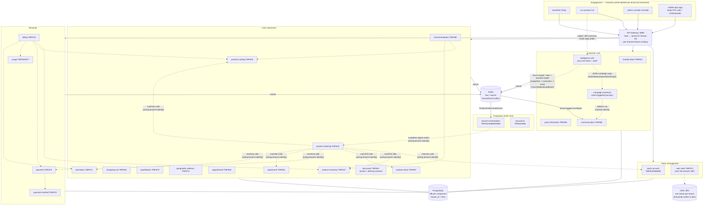
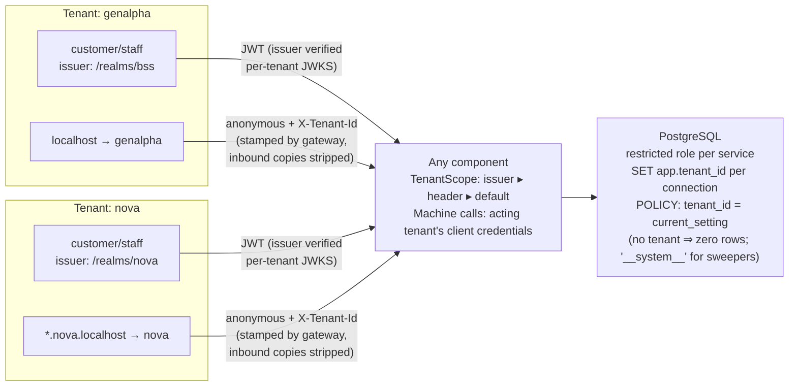
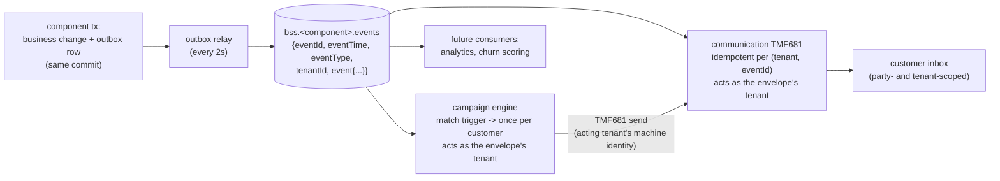

# Architecture views

Four views of genalpha-bss: what the components are, how tenancy works, how an order becomes
a bill, and how events move. All diagrams are Mermaid and render natively on GitHub.

## 1. Component map (ODA framing)

Channels talk to one gateway; the gateway routes TMF paths to components; components talk to
each other machine-to-machine (client credentials of the acting tenant) and publish domain
events to Kafka. Every component owns its own database.



## 2. Tenancy view (pool model with two locks)

Tenant identity derives from the **verified token issuer** — never from a claim a user could
edit. Anonymous traffic gets its tenant from the hostname at the gateway. Data isolation is
enforced twice: every query carries the tenant predicate in code, and PostgreSQL Row-Level
Security makes even predicate-free SQL tenant-safe.



Cross-tenant access reads as **404, never 403** — foreign ids do not leak existence. The same
pattern stacks three deep: tenant (operator) → org (partner/business unit, via the `org` claim)
→ party (customer).

## 3. Order-to-bill sequence

The storefront journey exercises almost every component. Staff completion is the current
BSS→SOM handoff seam (a thin service-orchestration layer can replace the manual step without
changing anything else).

```mermaid
sequenceDiagram
    autonumber
    actor C as Customer (browser)
    participant GW as gateway
    participant ADDR as address 673
    participant QUAL as qualification 679
    participant CART as cart 663
    participant ORD as ordering 622
    participant STOCK as stock 687
    participant PAY as payment 676
    participant VAULT as vault 670
    participant INV as inventory 637
    participant AGR as agreement 651
    participant PROMO as promotion 671
    participant BILL as billing 678
    participant USE as usage 635/677
    participant COMM as communication 681

    C->>CART: build cart (guest ok, promo code validated anonymously)
    C->>ADDR: validate address → standardized form
    C->>QUAL: serviceability check (gated offerings)
    C->>PAY: authorize one-time charges (card / PSP mock)
    opt save this card
        C->>VAULT: store token + last4 (never the PAN)
    end
    C->>ORD: productOrder (items, promo code, payment ref)
    ORD->>STOCK: reserve devices

    Note over ORD: completion — the SOM auto-completes digital orders
(via ProductOrderCreateEvent); staff/fulfilment completes physical ones
    ORD->>INV: provision products per item
    ORD->>STOCK: consume reservation
    ORD->>PAY: capture payment
    ORD->>AGR: mint commitment agreements (offering terms)
    ORD->>PROMO: redeem the promo for the owner

    Note over BILL: monthly billing run (staff/scheduled)
    BILL->>INV: active products per owner
    BILL->>USE: rate the period's usage → overage charges
    BILL->>PROMO: redemptions → discount lines
    BILL->>PAY: settle via new card or vaulted method

    ORD--)COMM: events → "Order received / complete"
    BILL--)COMM: events → "Your bill is ready"
    COMM--)C: tenant-scoped inbox notifications
```

## 4. Event backbone

Every write that matters is captured in the same transaction as the business change
(**transactional outbox**), relayed to Kafka, and consumed idempotently. Envelopes carry the
tenant, so downstream consumers stay partitioned without knowing anything about tenancy rules.



Editorially mapped today: order received/completed, bill ready, ticket resolved, installer
booked, cart abandoned ("still thinking it over?"). The campaign engine consumes the same
stream: a campaign is a trigger (event type, optionally a state) plus a message template and
an optional promotion code — matched campaigns reach each customer **exactly once** (a unique
execution row per tenant/campaign/party is the guarantee), delivered as TMF681 messages under
the acting tenant's machine identity.

## Boundary notes

- **The Production seam is now real (thin).** service-orchestration consumes order events,
  decomposes digital orders into TMF641 service orders, mock-activates (TMF640's stand-in),
  records TMF638 services and completes the product order machine-side. Physical/install
  orders still complete on fulfilment. Assurance is live in the same thin spirit: TMF642
  alarm intake (a simulator in dev), critical alarms auto-minting one open TMF656 service
  problem per affected object, resolution clearing the alarms — and agents see open outages
  as a banner across the CSR console.
- **Composability is real**: cross-component calls go through conditional clients with Noop
  fallbacks, channels hide features whose component is absent, and Helm skips disabled modules
  entirely — see the [composer](composer.html).
