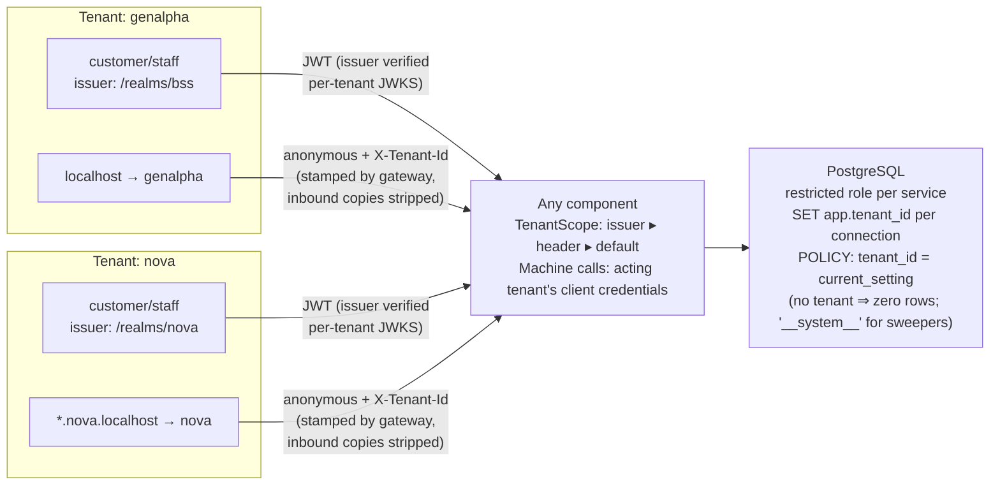
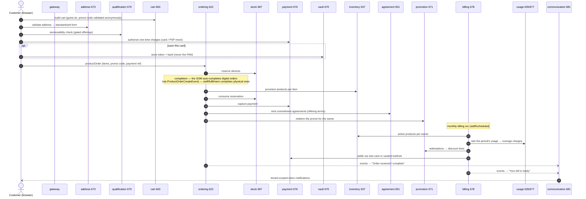
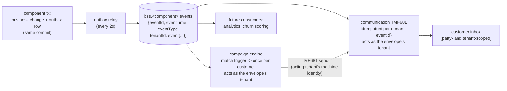

# Architecture views

Four views of genalpha-bss: what the components are, how tenancy works, how an order becomes
a bill, and how events move. All diagrams are Mermaid and render natively on GitHub.

## 1. Component map (ODA framing)

Channels talk to one gateway; the gateway routes TMF paths to components; components talk to
each other machine-to-machine (client credentials of the acting tenant) and publish domain
events to Kafka. Every component owns its own database. AI shopping agents (ChatGPT-class over
ACP, Claude-class over MCP) enter through the same gateway, behind a per-tenant
`agent-commerce: off | discovery | full` gate — dark by default, and checkout only ever on a
delegated, commerce-scoped token. AI **digital workers** (Hermes-class, any MCP runtime) enter
the same way but as badge-hired STAFF: a revocable `digital-worker` grant, a task queue derived
from real backlogs on the intelligence component, verified completion, and approvals a human
executes with their own token. With the opt-in **workforce package** deployed, the loop CLOSES:
its `worker-controller` (the only holder of spawn-rights — never the core BSS) makes hire = a
running container with the badge injected, fire = revoke + stop, and the worker's BRAIN
(`worker-ai-*` in the live registry) hot-swappable by config — the controller rolls the workers,
free because claims are self-expiring leases. And a tenant can WRAP a legacy BSS (suite #67):
three per-tenant seams federate its catalog, hand fulfilment back to its queue, and let the
workforce work its incident backlog — legacy stays the master, never two writers.

```mermaid
flowchart TB
    subgraph Channels["Engagement — channels (white-labeled per tenant by hostname)"]
        SHOP["storefront /shop"]
        BIZ["business-console /biz\n(org admin + member my-page)"]
        CSR["csr-console /csr"]
        ADMIN["admin-console /console"]
        APP["mobile-app /app\n(Expo RN: web + iOS/Android)"]
        DEALER["dealer-app /dealer-app\n(retail + telesales)"]
    end

    AGENTS(["AI shopping agents\nChatGPT/Perplexity (ACP) · Claude (MCP)\nfeed + delegated checkout"])

    WORKERS(["AI digital workers\nHermes / any MCP runtime\nbadge-hired staff: tickets ·\nunapplied cash · approvals"])

    WCTL["worker-controller\n(opt-in workforce package —\nthe ONLY holder of spawn-rights)"]

    GW["API Gateway :8080\nHost → tenant (X-Tenant-Id)\ntwo-ring rate limit (Redis)\nagent-commerce gate (off|discovery|full)\nper-channel tenant-config.js"]

    subgraph Party["Party management"]
        PARTY["party-account\nTMF632/666/669 · GDPR export/erase"]
        ROLES["user-roles TMF672\n(over the tenant's IdP)"]
    end

    subgraph Core["Core commerce"]
        CAT["product-catalog TMF620\n+ ACP product feed"]
        ORD["product-ordering TMF622"]
        INV["product-inventory TMF637"]
        CART["shopping-cart TMF663\n+ ACP checkout_sessions"]
        QUAL["qualification TMF679"]
        ADDR["geographic-address TMF673"]
        APPT["appointment TMF646"]
        STOCK["product-stock TMF687"]
        AGR["agreement TMF651"]
        PROMO["promotion TMF671"]
        REC["recommendation TMF680"]
        DOC["document TMF667\n(content seam: in-row / S3 / Azure Blob)"]
        QUOTE["quote TMF648 + TMF699\n(B2B quotes + sales leads)"]
        PORT["porting\n(MNP, per-country gateway)"]
    end

    subgraph Revenue["Revenue"]
        PAY["payment TMF676"]
        VAULT["payment-method TMF670"]
        BILL["billing TMF678\n(crash-resumable run + ledger)"]
        USAGE["usage TMF635/677"]
    end

    subgraph Production["Production (OSS, thin)"]
        SOM["service-orchestration
TMF641/638/640/685 · dealer + telesales"]
        ASSUR["assurance
TMF642/656"]
    end

    subgraph Decisioning["Decisioning & knowledge — rules as data, AI as a governed seam"]
        POLICY["policy\norder rules · dynamic pricing · personalization\n(JSON-logic, no redeploy)"]
        KNOW["knowledge\nFTS + pgvector semantic search"]
        INSIGHT["insight\nconsent spine · web/GA seam\nnext-hit session personalization"]
        AI["intelligence — the AI control plane\ncopilots · advisor · churn · For-you\nworkforce queue + approvals + KPIs\nmeter + budget + kill-switch + audit"]
    end

    subgraph Care["Customer care & martech"]
        TICKET["trouble-ticket TMF621"]
        INTER["party-interaction TMF683"]
        COMM["communication TMF681"]
        CAMP["campaign (martech)\nevent-triggered journeys · A/B · lift"]
    end

    FLOW["flow — Live Flow\n(read-only event observability)"]
    KAFKA[("Kafka\nbss.*.events\ntransactional outbox")]
    IDP[("OIDC IdPs\none issuer per tenant\n(Keycloak realms in dev)")]
    LEGACY[("A wrapped LEGACY BSS\n(per-tenant overlay seams —\nempty = native mode)")]
    PG[("PostgreSQL\nDB per component\ntenant_id + RLS")]

    SHOP & BIZ & CSR & ADMIN & APP & DEALER --> GW
    AGENTS -->|"/acp/* — per-tenant gate\noff → 404 · discovery → feed only"| GW
    WORKERS -->|"digital-worker badge (revocable)\nworkforce queue + TMF doors;\nrefunds/cease only as approvals"| GW
    GW -->|"/workforce-runtime/*\n(caller staff-verified by the BSS)"| WCTL
    WCTL -.->|"hire = start · fire = stop\nrolls workers on worker-ai-* change\nsurge scaling ≤ governance maxWorkers"| WORKERS
    GW --> Party & Core & Revenue & Decisioning & Care

    ORD -.->|"machine calls\n(acting tenant's identity)"| CAT & PARTY & INV & STOCK & PAY & AGR & PROMO
    CART -.->|"ACP complete: pricing from the feed,\norder + payment on the CALLER'S\ndelegated token (RFC 8693)"| CAT & ORD & PAY
    ORD -.->|policy check / price| POLICY
    BILL -.-> INV & CAT & PAY & USAGE & PROMO & POLICY
    PAY -.-> VAULT
    REC -.-> CAT & INV
    QUOTE -.-> CAT & AI
    SOM -.-> PORT
    CAMP -.->|"delivers via\nmachine identity"| COMM
    SHOP & APP -.->|"consent + beacons\n· For-you rail"| INSIGHT & AI
    INSIGHT -.->|experience rules| POLICY
    AI -.->|"campaign copy · product copilot\n· advisor · caption (governed)"| CAMP & CAT & KNOW
    CSR -.->|"copilot: 360 summary,\nNBO, ticket reply"| AI
    AI -.->|"churn engine → ChurnRiskDetectedEvent"| KAFKA
    AI -.->|"workforce queue DERIVES from\nreal backlogs (never copied)"| TICKET & BILL
    ROLES -.-> IDP
    CAT -.->|"federation: read-through,\nlegacy- prefixed, fail-soft"| LEGACY
    ORD -.->|"fulfilment HAND-OFF for\nlegacy- items (fail-soft, logged)"| LEGACY
    AI -.->|"workforce works the legacy\nincident backlog — completion\nVERIFIED against legacy state"| LEGACY

    Core & Revenue & Care & Decisioning -->|events| KAFKA
    KAFKA -->|"tenant-tagged envelopes"| COMM & INTER & FLOW
    KAFKA -->|"ProductOrderCreateEvent"| SOM
    SOM -.->|"completes digital orders
(acting tenant's identity)"| ORD
    Party & Core & Revenue & Care & Decisioning --- PG
```



## 2. Tenancy view (pool model with two locks)

Tenant identity derives from the **verified token issuer** — never from a claim a user could
edit. Anonymous traffic gets its tenant from the hostname at the gateway. Data isolation is
enforced twice: every query carries the tenant predicate in code, and PostgreSQL Row-Level
Security makes even predicate-free SQL tenant-safe.



Cross-tenant access reads as **404, never 403** — foreign ids do not leak existence. The same
pattern stacks three deep: tenant (operator) → org (partner/business unit, via the `org` claim)
→ party (customer).

## 3. Order-to-bill sequence

The storefront journey exercises almost every component. Staff completion is the current
BSS→SOM handoff seam (a thin service-orchestration layer can replace the manual step without
changing anything else).



## 4. Event backbone

Every write that matters is captured in the same transaction as the business change
(**transactional outbox**), relayed to Kafka, and consumed idempotently. Envelopes carry the
tenant, so downstream consumers stay partitioned without knowing anything about tenancy rules.



Editorially mapped today: order received/completed, bill ready, ticket resolved, installer
booked, cart abandoned ("still thinking it over?"). The campaign engine consumes the same
stream: a campaign is a trigger (event type, optionally a state) plus a message template and
an optional promotion code — matched campaigns reach each customer **exactly once** (a unique
execution row per tenant/campaign/party is the guarantee), delivered as TMF681 messages under
the acting tenant's machine identity.

## Boundary notes

- **The agent channel is gated, not assumed.** AI shopping agents reach only `/acp/*` (the
  product feed and the checkout-session lifecycle), behind the gateway's per-tenant
  `agent-commerce` switch: `off` → 404 (dark), `discovery` → feed only, `full` → delegated
  checkout. Newborn tenants are born `off`. Checkout never uses a machine identity — the
  shopper's token is exchanged (RFC 8693, Keycloak standard token exchange) through the
  `bss-agent` client into a credential scoped to exactly catalog-read + order + pay; the cart
  service forwards that token downstream and never lends its own.
- **The digital workforce is employed, not installed.** A worker (Hermes or any MCP runtime)
  holds a revocable `digital-worker` staff badge minted on TMF672 — the grant sheds the walk-in
  customer defaults, the revoke is the firing. Its task queue on the intelligence component
  derives LIVE from real backlogs (unassigned tickets, unapplied cash); claims are leases;
  completion is VERIFIED against the source system; refunds/cease/erasure only ever become
  approval rows a human executes with their own token; the tenant's one AI kill-switch stops
  workers and copilots alike; and the console's Workforce tab is the scoreboard (deflection,
  handle time, reopen rate, minutes-saved labeled as the estimate it is).
- **A legacy estate is just another seam (proven, suite #67).** Three per-tenant registry
  fields — `legacy-catalog-base-url`, `legacy-fulfilment-base-url`, `legacy-ticket-base-url`
  (empty = native mode) — wrap an existing BSS: its catalog federates read-through into the
  native list and the ACP feed (legacy-prefixed, cached, fail-soft — a dead legacy never breaks
  the native catalog); orders carrying legacy- items hand off to the legacy work-order queue
  (genalpha keeps the engagement record — never two writers); and the digital workforce works
  the legacy incident backlog age-stamped, with completion verified against the LEGACY system's
  own state.
- **The loop closes only by opt-in.** The workforce package's `worker-controller` is the sole
  holder of container spawn-rights (docker.sock / a scoped ServiceAccount — deployed via
  `--profile workforce`, never by default): one dashboard click hires a RUNNING worker with the
  badge injected (credentials touch no human), one click fires it (badge revoked AND container
  stopped), and the worker's LLM (`worker-ai-provider/base-url/api-key/model` in tenants.yml,
  live-refreshed) hot-swaps by config — the controller rolls the containers, safely, because
  claims are self-expiring leases. Suite #66 proves all of it, including the live brain swap.
- **The Production seam is now real (thin).** service-orchestration consumes order events,
  decomposes digital orders into TMF641 service orders, mock-activates (TMF640's stand-in),
  records TMF638 services and completes the product order machine-side. Physical/install
  orders still complete on fulfilment. Assurance is live in the same thin spirit: TMF642
  alarm intake (a simulator in dev), critical alarms auto-minting one open TMF656 service
  problem per affected object, resolution clearing the alarms — and agents see open outages
  as a banner across the CSR console.
- **Composability is real**: cross-component calls go through conditional clients with Noop
  fallbacks, channels hide features whose component is absent, and Helm skips disabled modules
  entirely — see the [composer](composer.html).

## 5. Cloud deployment view — proven on both AWS and Azure

The same Helm chart deploys the whole fleet; only the *substrate* differs, and it slots in
behind seams the application never sees. Both stacks ran live (single-node soak scope: core
commerce + billing×2 + the consoles), each proving the P0 tick-locks under two billing
replicas against a **managed** database.

```
        laptop (build) ──push──▶ registry ──pull──▶ managed k8s ──▶ managed Postgres
  AWS:   docker images           ECR                 EKS (Graviton)    RDS (single-AZ)
  Azure: docker images           ACR                 AKS (x86)         Flexible Server
```

What stays identical across clouds: the chart, the images, the in-cluster Kafka + Keycloak,
the seed realms, the smoke (`ops/k8s-soak/smoke.js`), and the security model. What the seams
absorb: the database is `local.postgres.enabled=false` + a managed host; the registry is one
`image.prefix`; the ingress/port-forward story is unchanged.

### Differences observed between the two clouds (live-run truths)

| Dimension | AWS EKS | Azure AKS |
|---|---|---|
| **Cluster access** | EKS module v20 grants the creator NO access by default — needs `enable_cluster_creator_admin_permissions` | AKS grants the creating principal admin automatically |
| **Node architecture** | Graviton (`t4g`, ARM) native + ~30% cheaper — matched the arm64 images directly | Sponsorship tier offered **no ARM sizes at all**; forced x86 (`EC2as_v5`) + cross-building images amd64 with buildx |
| **VM availability** | One instance family, available on ask | Gated **twice** — the offered catalog (`az vm list-skus`) AND per-family vCPU quota (`az vm list-usage`); a size can be listed with zero quota |
| **Region eligibility** | Any region in the account | New subscriptions **refused** westeurope outright; swedencentral had no AKS capacity — landed in northeurope |
| **Registry auth** | `aws ecr get-login-password` per session | Managed-identity `AcrPull` role — nodes pull with no password |
| **Database connections** | RDS `db.t4g.small` ≈ ample for 13 pools of 5 | Flexible Server `B1ms` caps ~50 — the fleet exhausted it; raised `max_connections` + shrank Hikari idle pools to 1 |
| **Postgres extensions** | pg_trgm / vector available on the image | Flexible Server refuses `CREATE EXTENSION` unless allow-listed via `azure.extensions` first |
| **TLS** | RDS accepts plaintext in-VPC | Flexible Server demands TLS by default — turned off for the soak (production keeps it, adds `sslmode=require`) |
| **Database creation** | psql init job over the fleet's `init-databases.sql` | 28 databases as Terraform resources — no init step |
| **Provisioning time** | ~20 min (EKS control plane dominates) | ~8 min cluster, but the sponsorship-tier gauntlet made the *session* longer |

The through-line: **the application code never changed** — every difference lived in Terraform
and two Helm `--set`s. The tenancy model, the RLS second lock, the tick-locks, the outbox, the
GDPR endpoints all behaved identically on both clouds. "Any cloud" is now two invoices, not a
claim. The AKS run also hardened the chart for *any* managed Postgres (bounded idle pools) and
gave the storefront a host-prebuilt image path (`Dockerfile.prebuilt`) for when
vite-under-emulation misbehaves.
