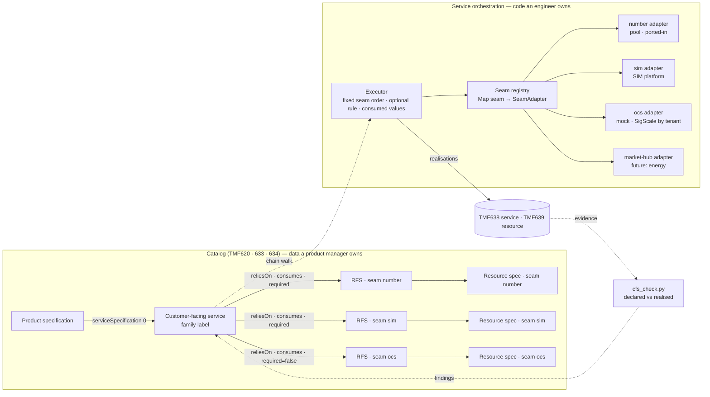
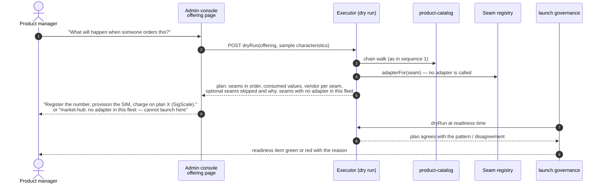
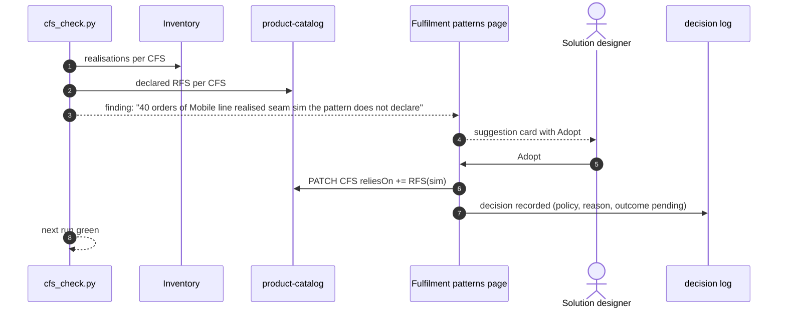

# Catalog-to-provisioning step 3 — design and sequences

*The build plan for spec #85, decided 25 September 2026: the orchestrator
obeys the resource-facing services the catalog declares, the category table
becomes a counted fallback, families become labels, and the executor is a
registry of seams so the next product line — a content platform for TV, an
electricity supply — is a data change plus adapters, never a change to the
orchestrator. Companion to [catalog-to-provisioning.md](catalog-to-provisioning.md)
(steps 1 and 2, built) and [catalog-authoring-research.md](catalog-authoring-research.md)
(why the authoring experience looks the way it does). Vocabulary: `CONTEXT.md`.*

## The shape in one picture



Three rules hold the picture together:

1. **The set of seams is data; the order and the seam logic are code.** A CFS
   says *which* RFS it relies on; the executor runs them in a fixed, safe
   order (wholesale access, partner, number, SIM, charging, slice, CPE; a
   pool-drawing seam such as `edge-gpu` takes the number slot for its family).
2. **The executor is the only reader of the product spec.** Each edge names
   what its RFS *consumes*; the executor reads those values off the product
   spec and the order item and hands the adapter a map. An adapter never
   reaches into the catalog itself.
3. **Families are labels.** `mobile`, `tv`, `energy`, `billing-only` mean
   something to people and screens; the code keys on the declared seams and
   two seam properties (creates a service record; draws from a pool).
   `billing-only` is simply a CFS with zero seams.

## Sequence 1 — an order is fulfilled from the catalog (tickets 2, 3)

```mermaid
sequenceDiagram
  autonumber
  participant PO as product-ordering
  participant SOM as service-orchestration<br/>Executor
  participant CAT as product-catalog<br/>TMF620/633/634
  participant REG as Seam registry
  participant AD as Seam adapter(s)
  participant INV as SOM inventory<br/>TMF638/639
  PO->>SOM: ProductOrderCreated (item: offering, product characteristics)
  SOM->>CAT: offering → product spec → serviceSpecification[0]
  CAT-->>SOM: CFS (family label) + reliesOn edges (RFS id, consumes, required)
  SOM->>CAT: each RFS → seam, resourceSpecification[0]
  CAT-->>SOM: RFS list with seams and resource specs (cached per CFS)
  alt spec names a CFS
    SOM->>SOM: plan = declared seams in fixed order;<br/>drop optional seams whose consumed values are all absent
  else spec names no CFS
    SOM->>SOM: plan = componentType(category) as before<br/>+ realisation on seam category-fallback (counted)
  end
  loop each seam in plan
    SOM->>REG: adapterFor(seam)
    REG-->>SOM: adapter or "no adapter in this fleet"
    SOM->>AD: run(tenant, service, consumedValues)
    AD-->>SOM: external reference (number, ICCID, order id, code)
    SOM->>INV: realisation (rfs, seam, vendor, externalRef, declared=true)
  end
  SOM->>INV: service record (when a declared seam creates one), resources with resourceSpecification
  SOM-->>PO: item state (completed / inProgress as today)
```

What does **not** change in this sequence: the adapters, their vendors, the
states the order item passes through, the numbers drawn. What changes: the
`if internet / tv / device / partner / security` ladder and the `"Slice"` /
`"Edge AI"` name tests are gone; the plan comes from the CFS.

## Sequence 2 — the counted fallback and the ratchet (ticket 3)

```mermaid
sequenceDiagram
  autonumber
  participant SOM as Executor
  participant INV as Inventory
  participant GATE as cfs_check.py
  participant RAT as ratchet.sh
  SOM->>INV: realisation seam=category-fallback, externalRef=category
  Note over SOM,INV: only when the product spec names no CFS
  GATE->>INV: page services, count category-fallback realisations
  GATE-->>GATE: print count; agreement check unchanged
  RAT->>GATE: metric categoryFallbacks (pinned in baseline.json)
  RAT-->>RAT: red if the count rises; may only fall
```

The debt is visible per service and per pull request. Deleting
`componentType()` is the last commit of that debt, when the count is zero.

## Sequence 3 — a product manager sets up a product (ticket 8a)

```mermaid
sequenceDiagram
  autonumber
  actor PM as Product manager
  participant CON as Admin console<br/>Product specification form
  participant COP as intelligence<br/>product copilot
  participant ONT as ontology<br/>governed action
  participant CAT as product-catalog
  PM->>CON: describes the product (name, characteristics, or free text)
  CON->>COP: propose fulfilment pattern for this spec
  COP->>CAT: list CFS by name and family (this tenant)
  COP-->>CON: card: "Mobile line — a network line.<br/>No charging plan: charging will not be provisioned. Add one?"
  PM->>CON: picks the pattern (or accepts the card) — Create is a click
  CON->>ONT: check + execute assignFulfilmentPattern (caller token)
  ONT->>CAT: PATCH product spec serviceSpecification[0] = CFS
  ONT-->>CON: receipt (who, what, when, verdict)
  CON-->>PM: Decomposition panel shows the chain; "Nothing to provision" when the CFS has no RFS
```

The product manager never sees a seam, an RFS or a vendor as a control. The
consequences are sentences. An AI agent authoring a product calls the same
governed action through MCP and gets the same receipt (ADR 0011, 0012).

## Sequence 4 — dry run before launch (ticket 8b)



## Sequence 5 — the evidence talks back (ticket 8c, next arc; gate part in ticket 6)



## Sequence 6 — adding a product line: energy (what step 3 makes possible)

```mermaid
sequenceDiagram
  autonumber
  actor ENG as Engineer
  actor SD as Solution designer
  actor PM as Product manager
  participant REG as Seam registry
  participant CAT as product-catalog
  participant SOM as Executor
  ENG->>REG: add adapters: market-hub (Elhub-style hub), grid-contract, meter-data<br/>one class each, a stand-in in the fleet, vendor per tenant in tenants.yml
  Note over ENG,REG: the only code in the story
  SD->>CAT: resource specs (seam market-hub, grid-contract, meter-data)
  SD->>CAT: RFS "Metering point takeover" (consumes meteringPointId, startDate; required)<br/>RFS "Grid tariff link" (consumes gridArea; required)<br/>RFS "Meter data feed" (consumes settlementMethod; required)
  SD->>CAT: CFS "Electricity supply", family energy, reliesOn the three
  PM->>CAT: product spec "Spot price electricity" → Fulfilment: Electricity supply
  PM->>SOM: dry run → "register the metering point, link the grid tariff, start the meter feed"
  Note over SOM: no executor change; the gate and the panel already know the new seams
```

The same story with one seam is TV on a real content platform: adapter
`content-entitlement`, resource spec, RFS "Entitlement activation", and the
TV entitlement CFS gains one edge.

## What each ticket builds

| Ticket | Builds | Proof |
|---|---|---|
| 1 Glossary and families | `CONTEXT.md` terms (compute, edge-gpu, billing-only, category-fallback, seam adapter, dry run); family set as labels | claims and ratchet |
| 2 Executor + seam registry | `SeamAdapter` interface, registry, executor with fixed order, optional rule, consumed-value map; existing adapters wrapped; behaviour-preserving | ordering suites green; unit test declared set × order × optional × values |
| 3 Counted fallback | `category-fallback` realisation; gate count; ratchet metric | ratchet proven red |
| 4 Name-based decisions retire | slice RFS with `deliveryPath`; `compute` family, `edge-gpu` seam adapter, "Edge inference" CFS; seeds stamp | slice_boost, ai_slice green |
| 5 Billing-only as data | CFS with zero seams; Insurance and Top-up specs; boost pass through a declared slice RFS | insurance / top-up suites green |
| 6 Suite #230 + battery | omit a seam and it does not run; optional rule; fallback realisation; gate clean both tenants | #230 + eleven suites |
| 7 Docs | catalog-to-provisioning step 3 built; remaining debt named | claims |
| 8a Pattern picker + copilot | Fulfilment field; copilot proposal card; `assignFulfilmentPattern` governed action | console suite; a11y; screenshot |
| 8b Dry run | SOM dry-run endpoint; offering page panel; launch-readiness item | suite through the gateway; governance suite |

## Honest limits

- The seam order stays a code decision on purpose. A catalog that could
  reorder seams could provision a SIM before a number exists.
- A seam with no adapter in a fleet is a gate finding and a failed dry run,
  not a runtime error: the product cannot be ordered there until an engineer
  adds the adapter. Energy is therefore "data plus three adapters", not
  "data".
- The counted fallback keeps `componentType()` alive until eleven suites and
  every legacy offering carry a CFS; the ratchet makes that visible, it does
  not make it free.
- The copilot proposing the right pattern for a free-text description is a
  suite to write, not a fact yet.
